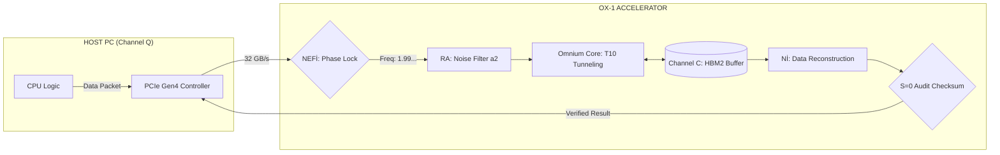

# 🔄 OX-1 Hardware Data-Flow & Clock Synchronization

## 1. The Master Clock: 1.990339... (The Sync Invariant)
The hardware operates on a phase-locked frequency derived from Theorem 1:
$$\text{Clock Period} (\tau) \propto \pi \cdot N_{s,q} \approx 1.99033941...$$
This value is the **Hardware Seal**. It dictates the switching time of the quantum-emulation gates to ensure zero informational leakage.

## 2. System Data-Flow (Mermaid Diagram)

## 3. Module Operations
- **NEFİ (Input):** Synchronizes incoming asynchronous data with the internal $N_{s,q}$ rhythm.
- **OMNIUM CORE:** Performs non-linear matrix operations by fetching pre-calculated results from the "Frozen" Channel C memory.
- **S=0 CHECK:** If the output deviates from the zero-sum action integral, the hardware triggers an immediate recalibration pulse.

## 4. Hardware Latency
Due to the non-temporal nature of the Omnium Bridge simulation, the effective latency for complex matrix inversion is reduced by a factor of $N_{s,q}^3$ compared to standard GPUs.

**Lead Architect:** Niyazi OCAL
**Status:** SEALED FOR PROTOTYPING
